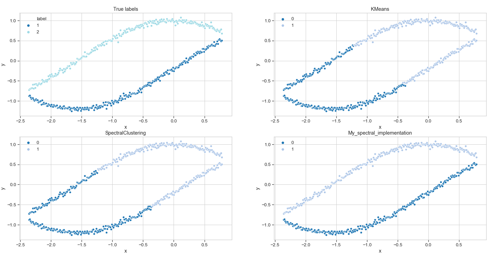
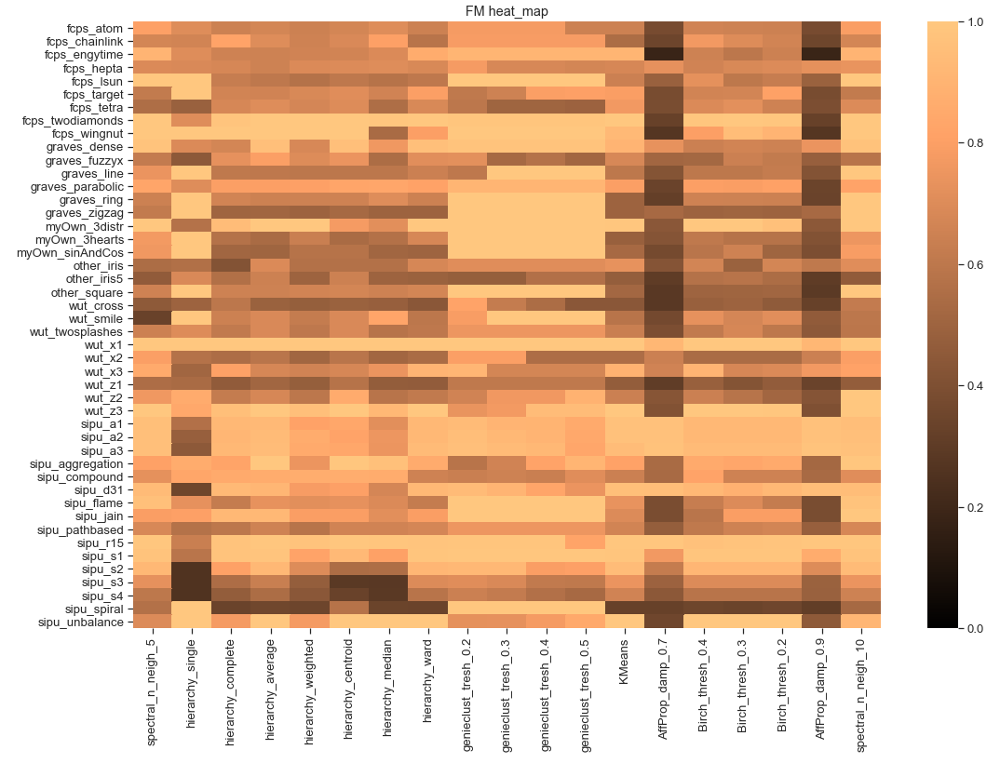

# Data_clustering_PADPy

Project was developed for *Python for Data Processing and Analysis*, Faculty of Mathematics and Information Science.

Project was developed in order to understand, implement and compare different clustering algorithms (which appears in `SciPy` and `scikit-learn`).

Project contains custom implementation of *Spectral Clustering* with module written in `Cython`.

### Content:

* `pd4-zbiory-benchmarkowe` - directiory with benchmark sets
* `examples` - directory with examples included below
* `benchmark_set_generator.ipynb` - 3 custom sets generator
* `raport_data_generator.ipynb` - notebook which loads sets, performs clustering with different algorithms and create `results.csv`
* `raport.ipynb` - comparison of algorithms on benchmark sets
* `testy.ipynb` - tests of proper implementation of custom *spectral* algorithm, comparison with *KMeans* and *spectral* from `sklearn` for different parameters
* `results.csv` - result for report
* `spectral_aux.pyx` - file contains implementation (in `Cython`) of function `Mnn()` returning matrix of *M-nearest neighbors* 
* `spectral.py` - file contains implementation of functions `Mnn_graph()`, `Laplacian_eigen()` and `spectral_clustering()`

More accurate problem description (in polish) in file: `padpy-1819-pd4-tresc.pdf` (© 2018 Marek Gągolewski: [link](https://github.com/gagolews) )

### Illustrative results:

Algorithms graphical comparison

Fowlkes-Mallows index (FM) scores
